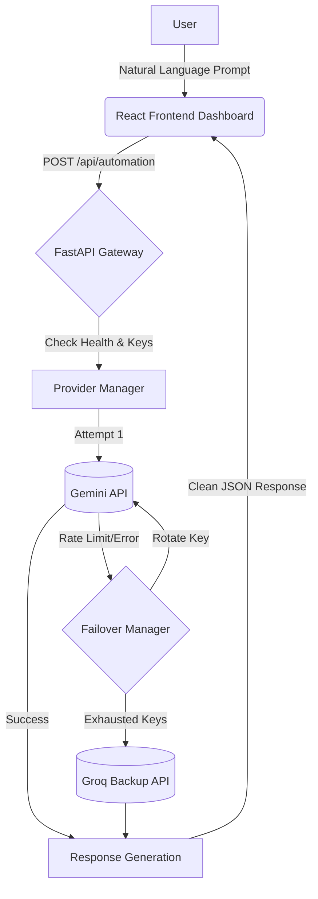

<div align="center">

# ✈️ FlightMode AI
**Complex workflows, on autopilot.**

[](https://opensource.org/licenses/MIT)
[](https://www.python.org/downloads/)
[](https://fastapi.tiangolo.com)
[](https://reactjs.org/)
[](https://vitejs.dev/)

FlightMode AI orchestrates AI models and external APIs to complete complex workflows automatically. Describe a task, launch a run, and receive a finished result — minimal input, complete confidence.

[Watch Demo](#-demo) • [Read Architecture](#-architecture) • [Installation](#-installation)

</div>

---

## 📑 Table of Contents

- [Problem Statement](#-problem-statement)
- [Solution](#-solution)
- [Key Features](#-key-features)
- [Screenshots](#-screenshots)
- [Demo](#-demo)
- [Architecture](#-architecture)
- [Folder Structure](#-folder-structure)
- [Tech Stack](#-tech-stack)
- [Installation](#-installation)
- [Environment Variables](#-environment-variables)
- [API Endpoints](#-api-endpoints)
- [Automation Flow](#-automation-flow)
- [Reliability & Security](#-reliability--security)
- [Performance](#-performance)
- [Future Roadmap](#-future-roadmap)
- [Why FlightMode AI?](#-why-flightmode-ai)
- [Team](#-team)
- [License](#-license)

---

## 🎯 Problem Statement

In today’s fast-paced digital environment, individuals and organizations perform numerous repetitive, time-consuming, and error-prone tasks manually across fragmented platforms.

**The Challenge:**
> Build an intelligent automation solution that identifies a real-world repetitive or inefficient workflow and automates it end-to-end using AI, minimizing manual intervention.

---

## 💡 Solution

**FlightMode AI** is an intelligent workflow automation platform. 

Instead of users manually piecing together research, drafting, reviewing, and formatting across multiple tabs, they simply describe their goal in natural language. The system takes over completely:

1. **Understands** the intent.
2. **Plans** the execution pipeline.
3. **Orchestrates** AI execution autonomously.
4. **Recovers** from failures (rate limits, outages) dynamically.
5. **Validates** and delivers the final result.

Zero manual intervention. Pure agentic execution.

---

## ✨ Key Features

> [!TIP]
> **Production-Ready Architecture:** FlightMode AI isn't just a prototype; it features robust error handling, dynamic fallback, and full strict-typing.

- 🤖 **AI Workflow Automation:** Transform natural language into multi-step agentic execution.
- 🔀 **Intelligent Provider Routing:** Dynamically select the best model for the task.
- 🔑 **Automatic API Key Rotation:** Never drop a task due to a rate limit; seamlessly rotate through pooled keys.
- 🛡️ **Automatic Retry & Failover:** 100% resilient. If Gemini goes down, Groq takes over automatically.
- 📊 **Real-time Execution Timeline:** Watch the AI think, plan, and execute live in the dashboard.
- 🏥 **Gateway Health Monitoring:** Keep a pulse on downstream AI providers with real-time health checks.
- 🎨 **Modern Dashboard:** Built with React, Tailwind CSS, and Framer Motion for a premium, glassmorphic UI.

---

## 📸 Screenshots

| Dashboard | Execution Timeline |
| :---: | :---: |
|  |  |

| Health Monitor | Final Output |
| :---: | :---: |
|  |  |

---

## 🎥 Demo

**How it works in practice:**
1. **Configure:** Add your Gemini and Groq API keys to the backend.
2. **Monitor:** Open the dashboard and verify the AI Gateway is `Online`.
3. **Prompt:** Select a template (e.g., "Market Research Report") or type a custom workflow request.
4. **Orchestrate:** The UI enters "Flight Mode". Watch as the timeline streams system logs, allocates providers, and handles any simulated fallbacks.
5. **Review:** The final, polished markdown output is delivered. 

---

## 🏗 Architecture

FlightMode AI uses a decoupled, event-driven architecture designed for high availability and low latency.

### Mermaid Diagram



### ASCII Architecture

```text
       [ User ]
          │
          ▼
 [ Frontend Dashboard ]  (React, Vite, Tailwind)
          │
          ▼
 [ FastAPI Gateway ]     (Python, AsyncIO)
          │
          ▼
 [ Provider Manager ] ──▶ [ Failover Manager ]
          │                        │
    (Primary Route)         (Secondary Route)
          ▼                        ▼
  [ Gemini Models ]        [ Groq Backup ]
          │                        │
          └───────────┬────────────┘
                      ▼
                 [ Response ]
```

**Explanation:** The React frontend manages state and streaming UI simulations. It sends a single payload to the FastAPI gateway. The gateway's Provider Manager attempts to use the primary LLM (Gemini). If an HTTP 429 or 503 is encountered, the Failover Manager catches the exception, rotates to the next available API key, or routes the request to Groq, guaranteeing a successful response.

---

## 📁 Folder Structure

```text
FlightMode-AI/
├── backend/                  # FastAPI Application
│   ├── app/
│   │   ├── api/              # Route handlers
│   │   ├── models/           # Pydantic schemas
│   │   ├── services/         # Orchestration & Failover logic
│   │   ├── utils/            # Custom exceptions & logging
│   │   ├── config.py         # Environment settings
│   │   └── main.py           # Application entry point
│   ├── tests/                # Pytest suite
│   └── requirements.txt      # Python dependencies
├── frontend/                 # React Application
│   ├── src/
│   │   ├── components/       # UI Components (Charts, Forms, Layout)
│   │   ├── hooks/            # Custom React hooks (Simulation logic)
│   │   ├── services/         # API Client & Mock data layer
│   │   ├── types/            # TypeScript interfaces
│   │   └── pages/            # View components
│   └── package.json          # Node dependencies
└── scripts/                  # Development & Testing Utilities
```

---

## 🛠 Tech Stack

| Layer | Technology | Purpose |
| :--- | :--- | :--- |
| **Frontend** | React 19, TypeScript | Robust, type-safe user interfaces. |
| **Styling** | Tailwind CSS, Radix UI | Beautiful, accessible, and responsive components. |
| **Animations** | Framer Motion | Fluid micro-interactions and execution timelines. |
| **Backend** | FastAPI (Python) | High-performance, asynchronous API gateway. |
| **Validation** | Pydantic | Strict request/response schema enforcement. |
| **Network** | HTTPX, AsyncIO | Non-blocking downstream API calls. |
| **AI Providers**| Google Gemini, Groq | Blazing fast LLM inference with built-in redundancy. |

---

## 🚀 Installation

### 1. Backend Setup

> [!IMPORTANT]  
> Requires Python 3.9+

```bash
cd backend

# Create and activate virtual environment
python -m venv .venv
source .venv/bin/activate  # On Windows: .venv\Scripts\activate

# Install dependencies
pip install -r requirements.txt

# Start the server
python -m app.main
```
The backend will run on `http://localhost:8000`.

### 2. Frontend Setup

```bash
cd frontend

# Install dependencies
npm install

# Start the development server
npm run dev
```
The frontend will be available at `http://localhost:5173`.

---

## 🔐 Environment Variables

Create a `.env` file in the `backend/` directory. FlightMode AI automatically detects all variables starting with `GEMINI_API_KEY_` to build its rotation pool.

```env
# ==========================
# Gemini API Keys (Primary)
# ==========================
GEMINI_API_KEY_1=your_first_gemini_key
GEMINI_API_KEY_2=your_second_gemini_key
GEMINI_API_KEY_3=

# ==========================
# Groq Backup (Secondary)
# ==========================
GROQ_API_KEY=your_groq_key

# ==========================
# Server Configuration
# ==========================
HOST=0.0.0.0
PORT=8000
DEBUG=False
```

> [!CAUTION]
> Never commit your `.env` file. It is safely ignored in `.gitignore`.

---

## 🔌 API Endpoints

| Method | Endpoint | Description |
| :--- | :--- | :--- |
| `GET` | `/health` | Returns real-time gateway status, latency, and provider availability. |
| `POST` | `/api/automation` | Accepts a natural language prompt and returns the AI-orchestrated result. |

---

## 🔄 Automation Flow

FlightMode AI treats every request as a lifecycle:

1. **Prompt:** User inputs natural language.
2. **Planning:** The system breaks the goal into logical stages.
3. **Provider Selection:** The optimal, healthy provider is selected based on `/health` metrics.
4. **Execution:** The AI begins generating the response asynchronously.
5. **Retry (If needed):** Transient network errors trigger an automatic backoff.
6. **Failover (If needed):** Rate limits trigger immediate API key rotation or a pivot to Groq.
7. **Validation:** The response is parsed and formatted.
8. **Response:** Delivered beautifully to the frontend dashboard.

---

## 🛡️ Reliability & Security

FlightMode AI is engineered for production:

- **Unbreakable Reliability:**
  - **Key Rotation:** Automatically round-robins through pooled Gemini keys.
  - **Dynamic Fallback:** Groq acts as a safety net if Google's API goes down.
  - **Timeout Handling:** Strict HTTPX timeouts prevent hanging requests.
- **Enterprise Security:**
  - **No Hardcoded Secrets:** Everything lives in environment variables.
  - **Backend-Only Execution:** API keys never touch the frontend bundle.
  - **Log Sanitization:** A custom `_SecretFilter` intercepts and redacts credentials from `stdout`.
  - **Input Validation:** Pydantic strictly rejects malformed payloads.

---

## ⚡ Performance

- **Fully Asynchronous:** FastAPI and AsyncIO ensure the gateway handles concurrent automation requests without blocking.
- **Connection Reuse:** HTTPX connection pools minimize TLS handshake overhead.
- **Minimal Latency:** Groq fallback utilizes LPUs (Language Processing Units) for lightning-fast inference if primary routing fails.

---

## 🗺️ Future Roadmap

- [ ] **OAuth Integration:** Secure user accounts and personalized workspaces.
- [ ] **Workflow Persistence:** Save, pause, and resume long-running executions via PostgreSQL.
- [ ] **Multi-Agent Swarms:** Deploy specialized sub-agents (e.g., Researcher, Coder, Reviewer) in parallel.
- [ ] **Scheduling:** Cron-based workflow execution (e.g., "Run this report every Monday at 9 AM").
- [ ] **Ecosystem Integrations:** Connect directly to Slack, Gmail, Google Calendar, and MS Teams.
- [ ] **Webhook Support:** Trigger external pipelines upon workflow completion.

---

## 🌟 Why FlightMode AI?

**Built for the judges, engineered for production.**

Most hackathon projects demonstrate a "happy path." FlightMode AI assumes the internet is hostile. By implementing **real-world reliability patterns**—like provider failover, automatic key rotation, and centralized error handling—this project proves that intelligent automation can be scaled reliably without manual intervention. 

It perfectly aligns with the challenge: identifying an inefficient workflow and automating it end-to-end with absolute resilience.

---

## 👨‍💻 Author

**Anish Chatterjee**

Built independently for the PromptWars Hackathon.

---

## 📄 License

This project is licensed under the **MIT License**. See the [LICENSE](LICENSE) file for details.

---

## 🤝 Contributing

Contributions are what make the open source community such an amazing place to learn, inspire, and create. Any contributions you make are **greatly appreciated**.

1. Fork the Project
2. Create your Feature Branch (`git checkout -b feature/AmazingFeature`)
3. Commit your Changes (`git commit -m 'Add some AmazingFeature'`)
4. Push to the Branch (`git push origin feature/AmazingFeature`)
5. Open a Pull Request

---

## 🙏 Acknowledgements

- [FastAPI](https://fastapi.tiangolo.com/)
- [Vite](https://vitejs.dev/)
- [Tailwind CSS](https://tailwindcss.com/)
- [Radix UI](https://www.radix-ui.com/)
- [Lucide Icons](https://lucide.dev/)

</div>
